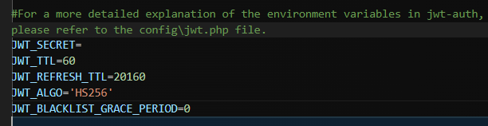
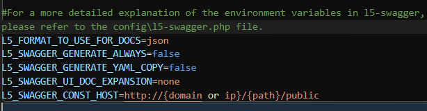

# ENV 設定

## 在那之前先來做環境初始化
### 先來確認以下事情
#### 1. .env 設定
>.env 檔並不會預設就存在，因為這是整個專案的環境變數

> 將 .env.example 複製成 .env

>會被放在 [.gitignore](https://medium.com/@ji3g4kami/gitignore-%E5%A4%A7%E5%B0%8F%E4%BA%8B-9016584660f6) 放於例外


#### 2. 預設情況下，不會有 APP key
> 透過artisan產生一組網站專屬密鑰用來確保session、password等加密資料安全性


```bash=
php artisan key:generate
```
>就會在 .env 產生


#### 3. 設定資料庫資訊


#### 4. 設定時區
>台灣是Asia/Taipei (UTC+8)


---
## 以下為在 Linux 的環境需要做的事情
https://learnku.com/laravel/wikis/25560
### storage 權限不足


#### 本主機是開發環境用
>將檔案權限全開啟(不安全)
```
chmod -R 0777 storage
```

#### 本主機是正式環境用
>正式環境上應該遵循「最小權限原則」

```
chown -R www-data:www-data storage
```

## 正式環境下務必

```
APP_NAME
config/app.php
預設為 Laravel
此服務名稱

APP_ENV
config/app.php
預設為 production
此開發環境，用於加載不同環境時的配置
理論是可以任何值，只要團隊說好就行

通常為
開發: local
測試: test
預上線: staging #嚴謹時才會出現
正式環境: production

APP_DEBUG
config/app.php
預設為 false
開啟時一旦發生錯誤會跳在網頁上，有可能會將重要資訊或程式碼洩漏

APP_URL
config/app.php
預設為 http://localhost
為此服務預設的網頁根目錄
```

#### 5. 產生 JWT 的密鑰 以及配置設定
```php
php artisan jwt:secret
# 會問你要不要覆蓋，yes
# 剩餘設定皆是預設，為比較有用的設定
# 請到 config\jwt.php 查看說明細節
```


#### 6. 產生 swagger 以及配置設定
```php
php artisan l5-swagger:generate
# 產生 swagger 文檔

L5_SWAGGER_CONST_HOST=http://{domain or ip}/{path}/public
# 這個是範例
# L5_SWAGGER_CONST_HOST=http://localhost/laravel-learn/public
# 剩餘設定皆是預設，為比較有用的設定
# 請到 config\l5-swagger.php 查看說明細節

L5_FORMAT_TO_USE_FOR_DOCS=json
# 預設顯示格式，json or yaml
# 但要使用 yaml，L5_SWAGGER_GENERATE_YAML_COPY 必須為 true
L5_SWAGGER_GENERATE_ALWAYS=false
# true，即不用一直下 php artisan l5-swagger:generate 就會更新文檔
L5_SWAGGER_GENERATE_YAML_COPY=false
# true，即會產生 yaml 格式
L5_SWAGGER_UI_DOC_EXPANSION=none
# 預設為none，進入文檔首頁顯示方式
# 'list' (expands only the tags),
# 'full' (expands the tags and operations),
# 'none' (expands nothing).
```


加入 git 不追蹤
```bash
# .gitignore 加入
/storage/api-docs
```

打開網頁
```bash
http://{domain or ip}/{path}/public/api/documentation
# 路徑是 config\l5-swagger.php 設定的
```
成功啟動會呈現這樣


### 開發者幫助工具
#### 如需更多得配置細節可以看下面這篇文章
[Laravel 超好用代码提示工具 Laravel IDE Helper](https://learnku.com/articles/10172/laravel-super-good-code-prompt-tool-laravel-ide-helper)
#### 產生套件提示
```
php artisan ide-helper:generate
```
加入 git 不追蹤
```bash
# .gitignore 加入
/_ide_helper.php
```
#### 產生Model 資料庫操作提示
```bash
php artisan ide-helper:models
# 要選 no ，_ide_helper_models.php 他會產生提示
# 選 yes，會注入註解到 model，不需要麼做
```
加入 git 不追蹤
```bash
# .gitignore 加入
/_ide_helper_models.php
```