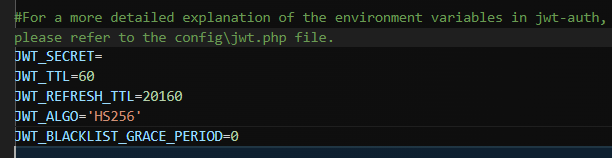
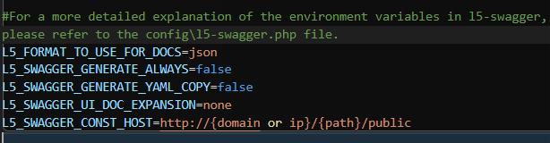
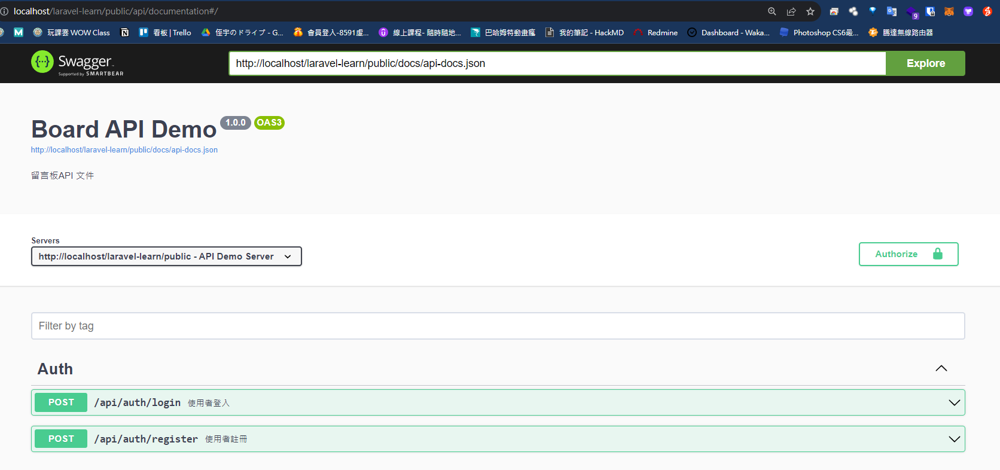

# ENV 設定

同步於
https://hackmd.io/@jone20688392/HJioKdA7i/https%3A%2F%2Fhackmd.io%2F6yKtSGP6QZmk3d1THKDppQ%3Fview

## 在那之前先來做環境初始化
### 先來確認以下事情
#### 1. .env 設定
>.env 檔並不會預設就存在，因為這是整個專案的環境變數

> 將 .env.example 複製成 .env

>會被放在 [.gitignore](https://medium.com/@ji3g4kami/gitignore-%E5%A4%A7%E5%B0%8F%E4%BA%8B-9016584660f6) 放於例外


#### 2. 預設情況下，不會有 APP key
> 透過artisan產生一組網站專屬密鑰用來確保session、password等加密資料安全性


```bash=
php artisan key:generate
```
>就會在 .env 產生


3. 設定資料庫資訊


4. 設定時區
>不更改的話是寫死的，輸出的時間都將會是UTC，台灣是Asia/Taipei (UTC+8)

> 於 config/app.php

> 找到 timezone ，將原本的改成

> 'timezone' => env('APP_TIMEZONE', 'UTC'),

> 將它取代成使用環境變數，沒有的情況預設 UTC


> 記得 .env 和 .env.example 都要加上


---
## 以下為在 Linux 的環境需要做的事情
https://learnku.com/laravel/wikis/25560
### storage 權限不足


#### 本主機是開發環境用
>將檔案權限全開啟(不安全)
```
chmod -R 0777 storage
```

#### 本主機是正式環境用
>正式環境上應該遵循「最小權限原則」

```
chown -R www-data:www-data storage
```

## 正式環境下務必

```
APP_NAME
config/app.php
預設為 Laravel
此服務名稱

APP_ENV
config/app.php
預設為 production
此開發環境，用於加載不同環境時的配置
理論是可以任何值，只要團隊說好就行

通常為
開發: local
測試: test
預上線: staging #嚴謹時才會出現
正式環境: production

APP_DEBUG
config/app.php
預設為 false
開啟時一旦發生錯誤會跳在網頁上，有可能會將重要資訊或程式碼洩漏

APP_URL
config/app.php
預設為 http://localhost
為此服務預設的網頁根目錄
```

#### 5. 產生 JWT 的密鑰 以及配置設定
同步於
https://hackmd.io/@jone20688392/HJioKdA7i/https%3A%2F%2Fhackmd.io%2FLPFDeBk4SrabBda4vJ8H4w%3Fview#laravel-JWT-%E5%AE%89%E8%A3%9D

> 於正式環境使用
```
composer require tymon/jwt-auth
```
#### 5.1配置設定
#### 5.1.1 發佈設定
>這裡值得注意的是，有些文檔會說要添加 service provider
>`Tymon\JWTAuth\Providers\LaravelServiceProvider::class` 進`config/app.php`，這只在Laravel 5.4 及以下版本是必要的，更新的Laravel 版本無需添加。

>還有一些文檔說要添加`Tymon\JWTAuth\Providers\JWTAuthServiceProvider `這是很久以前的JWT 版本的（大概0.5.3 以前的版本）。

#### 這條命令會在 `config` 下增加一個 `jwt.php` 的配置文件
```bash=
php artisan vendor:publish --provider="Tymon\JWTAuth\Providers\LaravelServiceProvider"
```
#### 5.1.2 產生JWT隨機加密金鑰

```bash=
php artisan jwt:secret
```
#### 成功後可在 .env 中看到如下的畫面
>會出現在最底下

> 記得 .env 和 .env.example 都要加上


#### 5.1.3 調整User model
>1. use Tymon\JWTAuth\Contracts\JWTSubject;
>2. class 宣告要 implements JWTSubject
>3. 結尾加入兩個 function，getJWTIdentifier() 和 getJWTCustomClaims()
```php=
<?php

namespace App\Models;

use Tymon\JWTAuth\Contracts\JWTSubject;
use Illuminate\Foundation\Auth\User as Authenticatable;
use App\Models\Post;

class User extends Authenticatable implements JWTSubject
{
    /**
     * 
     *  
     */


    /**
     * Get the identifier that will be stored in the subject claim of the JWT.
     *
     * @return mixed
     */
    public function getJWTIdentifier()
    {
        return $this->getKey();
    }

    /**
     * Return a key value array, containing any custom claims to be added to the JWT.
     *
     * @return array
     */
    public function getJWTCustomClaims()
    {
        return [];
    }
}
```
#### 5.1.4 註冊兩個Facade
在`config/app.php`內註冊兩個Facade，為了是方便使用==JWTAuth==和==JWTFactory==的功能
這兩個Facade 並不是必須的，但是使用它們會給你的代碼編寫帶來一點便利。
```bash=
'aliases' => [
    ....
    'JWTAuth' => Tymon\JWTAuth\Facades\JWTAuth::class,
    'JWTFactory' => Tymon\JWTAuth\Facades\JWTFactory::class,
    ....
],
```
如果你不使用這兩個Facade，你可以使用輔助函數auth ()

auth () 是一個輔助函數，返回一個guard，暫時可以看成Auth Facade。

對於想更進階了解更多資訊，請看[JWT 扩展具体实现详解](https://learnku.com/articles/10889/detailed-implementation-of-jwt-extensions)

```php=
// 如果你不用 Facade，你可以这么写
auth('api')->refresh();
// 用 JWTAuth Facade
JWTAuth::parseToken()->refresh();
```
#### 5.1.5 修改auth.php
#### config/auth.php
```php=
'defaults' => [
    'guard' => 'api',
    // 原本是默認 web，但可以改默認成 api
    // 就是上面的 auth('api')->refresh();
    // 改了後就可以用 auth()->refresh();
    'passwords' => 'users',
],
'guards' => [
    'web' => [
        'driver' => 'session',
        'provider' => 'users',
    ],

    'api' => [
        'driver' => 'jwt',
        'provider' => 'users',
    ],
],

```

#### 5.1.6 其餘參數設定
```php
# 剩餘設定皆是預設，為比較有用的設定
# 請到 config\jwt.php 查看說明細節
```
> 記得 .env 和 .env.example 都要加上



#### 6. 產生 swagger 以及配置設定

安裝 DarkaOnLine/L5-Swagger：
```bash=
composer require darkaonline/l5-swagger
```
安裝完之後我們可以將 L5-Swagger 的 config 與 view 檔案 publish 到我們的專案裡：
#### 方法1：
```bash=
php artisan vendor:publish
```

#### 方法2：
```bash=
php artisan vendor:publish --provider "L5Swagger\L5SwaggerServiceProvider"
```
#### 兩個方法都會產生
```php
# 加入版控，為 swagger 設定複製 UI 畫面所引用的程式碼
resources\views\vendor\l5-swagger\.gitkeep
resources\views\vendor\l5-swagger\index.blade.php
```

> 記得 .env 和 .env.example 都要加上

```php
php artisan l5-swagger:generate
# 產生 swagger 文檔

L5_SWAGGER_CONST_HOST=http://{domain or ip}/{path}/public
# 這個是範例
# L5_SWAGGER_CONST_HOST=http://localhost/laravel-learn/public
# 剩餘設定皆是預設，為比較有用的設定
# 請到 config\l5-swagger.php 查看說明細節

L5_FORMAT_TO_USE_FOR_DOCS=json
# 預設顯示格式，json or yaml
# 但要使用 yaml，L5_SWAGGER_GENERATE_YAML_COPY 必須為 true
L5_SWAGGER_GENERATE_ALWAYS=false
# true，即不用一直下 php artisan l5-swagger:generate 就會更新文檔
L5_SWAGGER_GENERATE_YAML_COPY=false
# true，即會產生 yaml 格式
L5_SWAGGER_UI_DOC_EXPANSION=none
# 預設為none，進入文檔首頁顯示方式
# 'list' (expands only the tags),
# 'full' (expands the tags and operations),
# 'none' (expands nothing).
```


加入 git 不追蹤
```bash
# .gitignore 加入
/storage/api-docs
```

打開網頁
```bash
http://{domain or ip}/{path}/public/api/documentation
# 路徑是 config\l5-swagger.php 設定的
```
成功啟動會呈現這樣


### 開發者幫助工具
> 於開發環境使用
```
composer require --dev barryvdh/laravel-ide-helper
```
#### 於開發環境使用
```php=
# app\Providers\AppServiceProvider.php
public function register()
{
    if ($this->app->environment() !== 'production') {
        $this->app->register(\Barryvdh\LaravelIdeHelper\IdeHelperServiceProvider::class);
    }
    // ...
}

```
#### 如需更多得配置細節可以看下面這篇文章
[Laravel 超好用代码提示工具 Laravel IDE Helper](https://learnku.com/articles/10172/laravel-super-good-code-prompt-tool-laravel-ide-helper)
#### 產生套件提示
```
php artisan ide-helper:generate
```

#### 產生Model 資料庫操作提示
```bash
php artisan ide-helper:models
# 要選 no ，_ide_helper_models.php 他會產生提示
# 選 yes，會注入註解到 model，不需要麼做
```